# UML Diagrams (Standard Astah) - Sistem Prediksi Penyebaran DBD RSUD Lubuk Basung

Dokumen ini berisi kumpulan diagram UML untuk **Sistem Prediksi Penyebaran DBD menggunakan Algoritma Random Forest di RSUD Lubuk Basung**, dirancang sesuai dengan **standardisasi Astah UML** berdasarkan dokumen [BABIV.pdf](file:///home/vue/Documents/frelence/joki/BABIV.pdf).

---

## 1. Use Case Diagram (Gambar 4.26)
Sesuai dengan standar Astah, hubungan aktor ke use case menggunakan garis solid asosiasi sederhana (tanpa mata panah), sedangkan relasi dependensi `<<include>>` dan `<<extend>>` menggunakan garis putus-putus berpanah dengan arah yang benar.

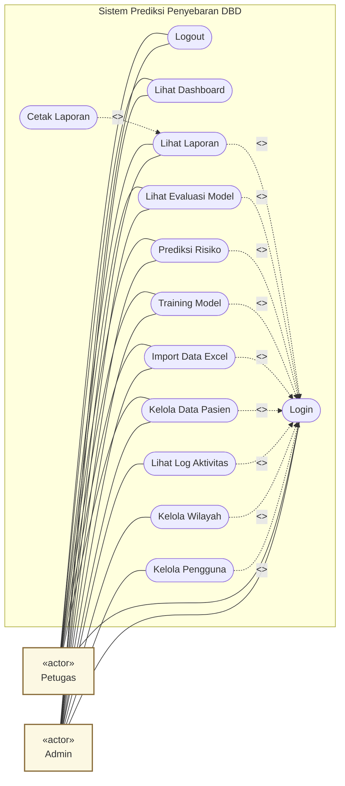

---

## 2. Class Diagram (Gambar 4.27)
Representasi kelas-kelas entitas database (skema relasional) lengkap dengan visibilitas (`-` untuk private, `+` untuk public), tipe data standard Astah, serta relasi asosiasi berarah beserta multiplisitasnya.

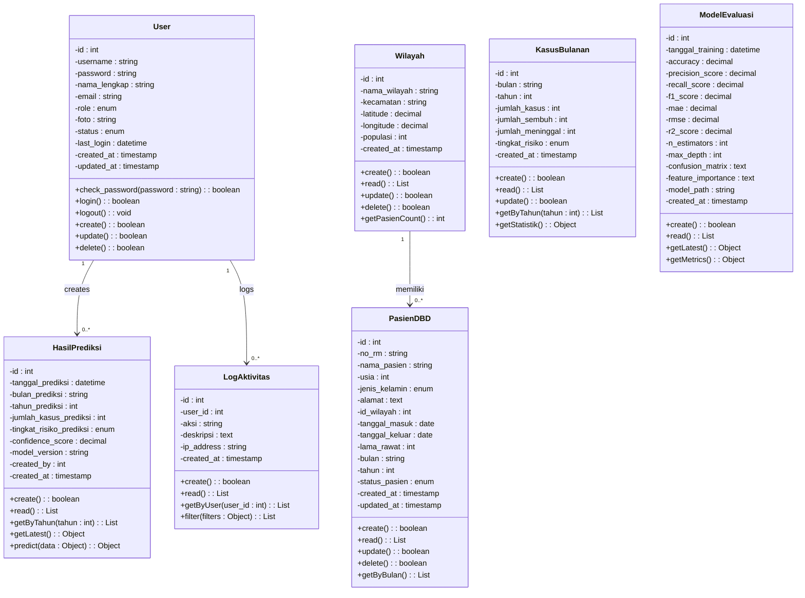

---

## 3. Activity Diagram (Diagram Aktivitas)
Menggunakan format swimlane (partition) untuk membagi tanggung jawab antara Aktor dan Sistem.

### A. Activity Diagram Admin (Gambar 4.28)
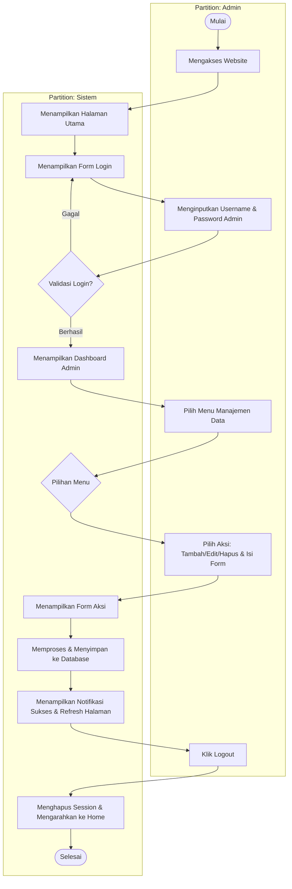

### B. Activity Diagram Petugas (Gambar 4.29)
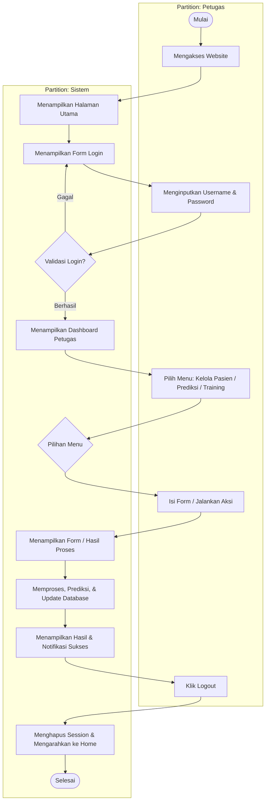

---

## 4. Sequence Diagram (Diagram Urutan)
Sequence Diagram di bawah ini menggunakan konvensi Astah di mana terdapat Aktor, Boundary (Halaman/UI), Control (Proses/API), dan Entity (Database/Model).

### A. Sequence Diagram Login (Gambar 4.31)
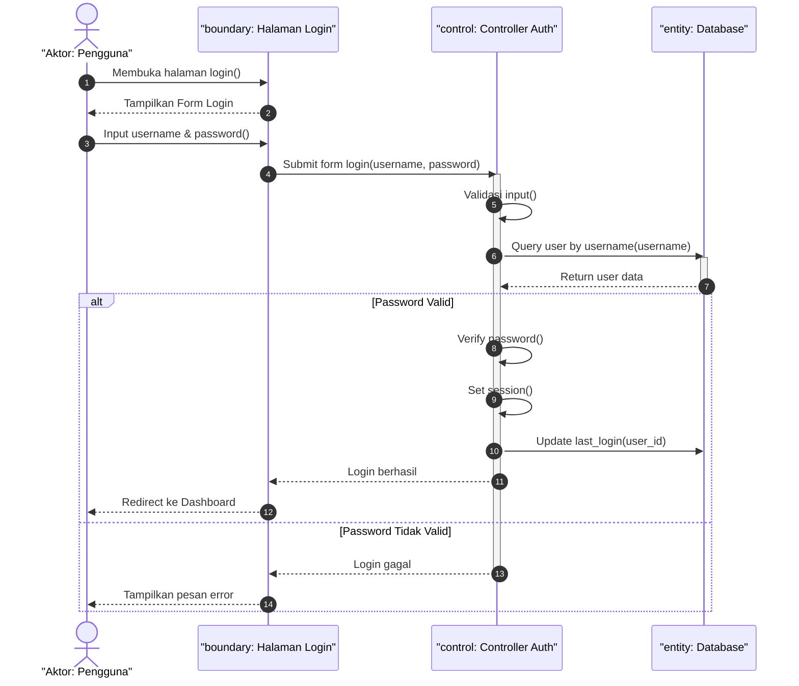

### B. Sequence Diagram Kelola Data Pasien (Gambar 4.32)
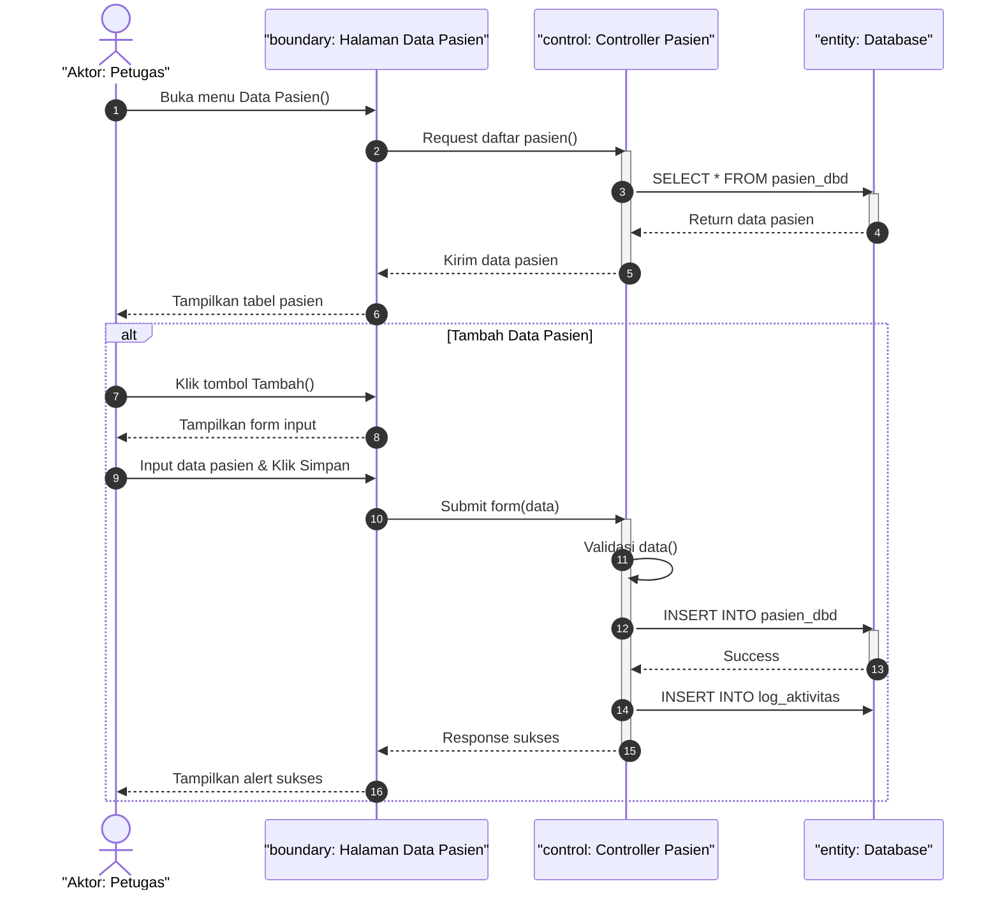

### C. Sequence Diagram Import Data Excel (Gambar 4.33)
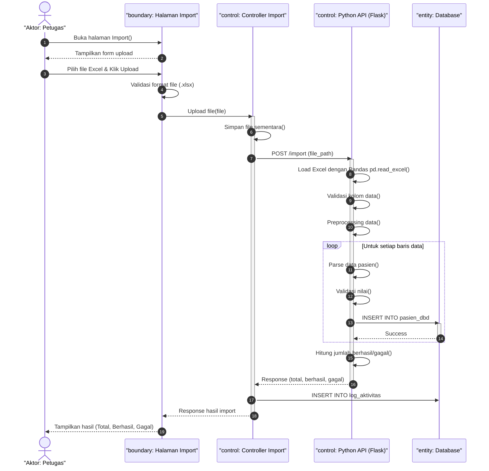

### D. Sequence Diagram Training Model (Gambar 4.34)
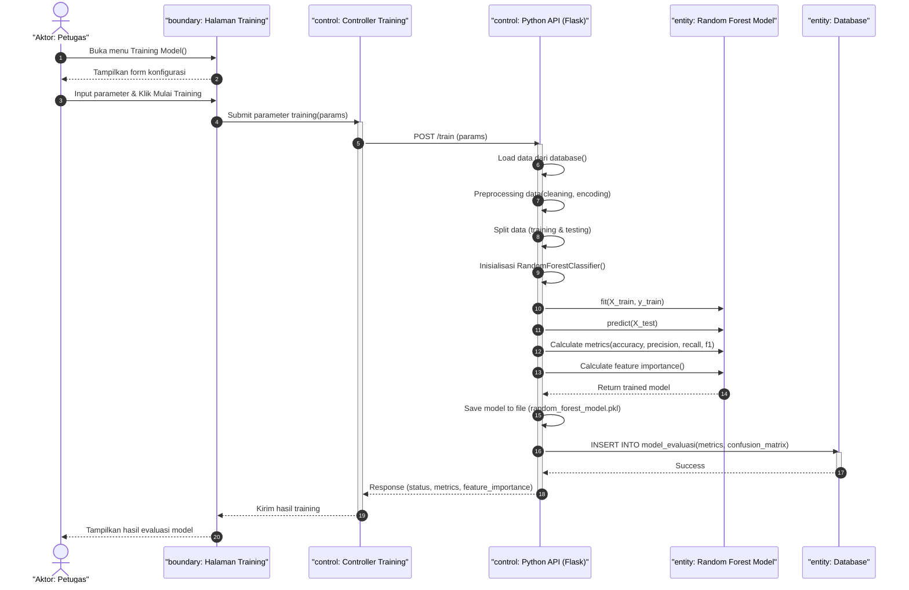

### E. Sequence Diagram Prediksi Risiko (Gambar 4.35)
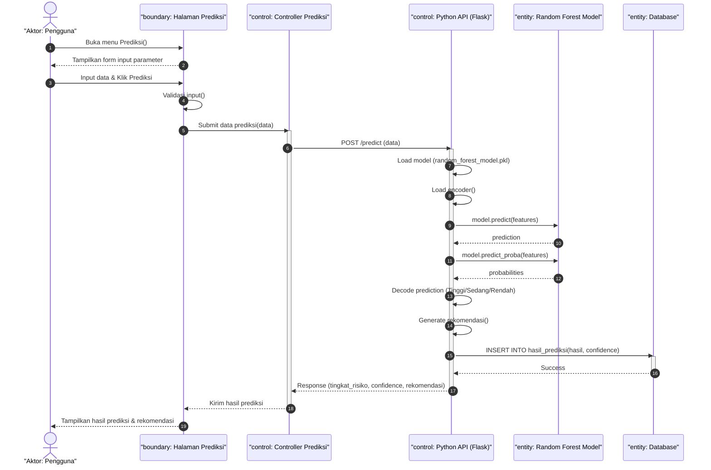

### F. Sequence Diagram Lihat Laporan (Gambar 4.36)
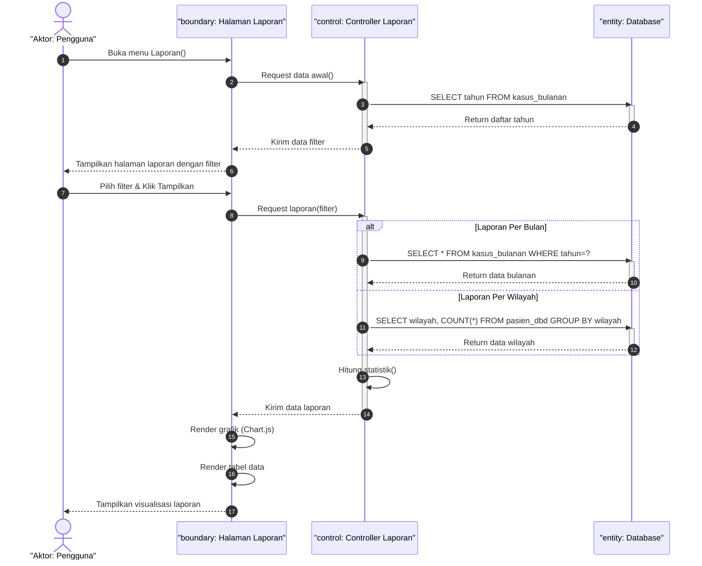

### G. Sequence Diagram Kelola Pengguna (Gambar 4.37)
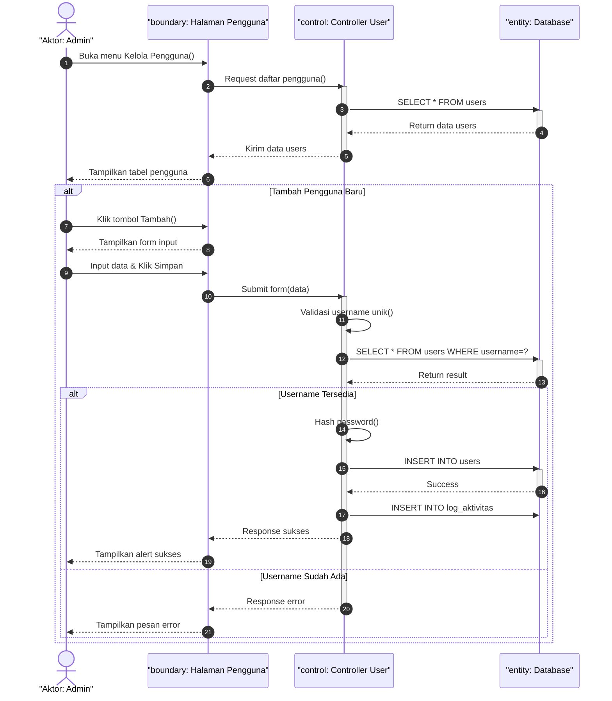

---

## 5. State Chart Diagram (Gambar 4.39)
Menggambarkan perubahan state sistem dari kondisi awal, proses login, dan alur sub-state saat berpindah fitur di dashboard.

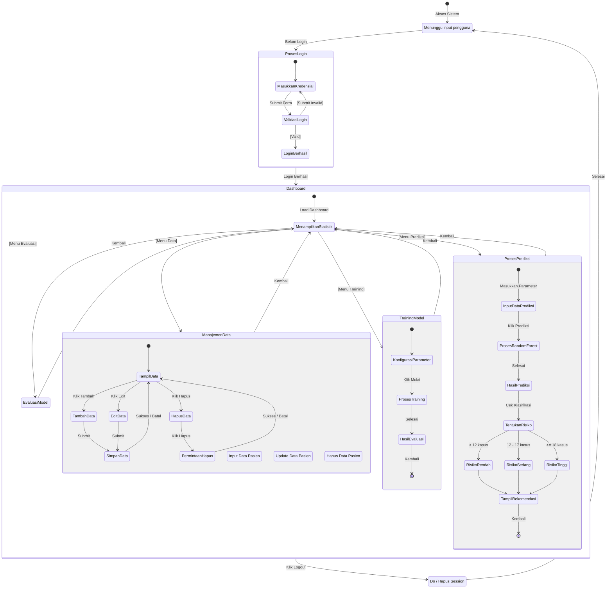

---

## 6. Deployment Diagram (Gambar 4.38)
Diagram deployment fisik yang menggambarkan topologi hardware, middleware, server web (Apache/Python), database (MySQL), dan protokol komunikasi yang digunakan.

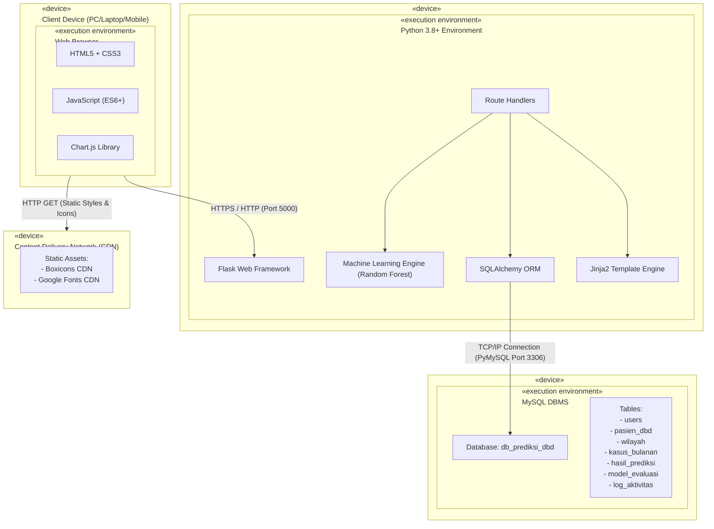
